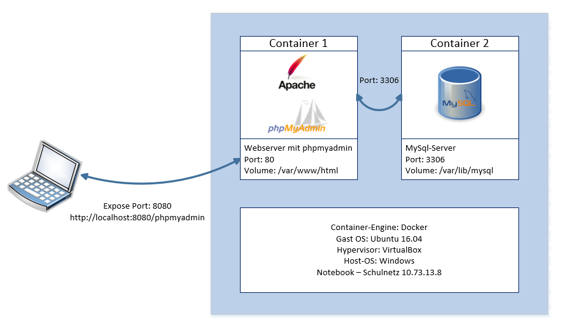
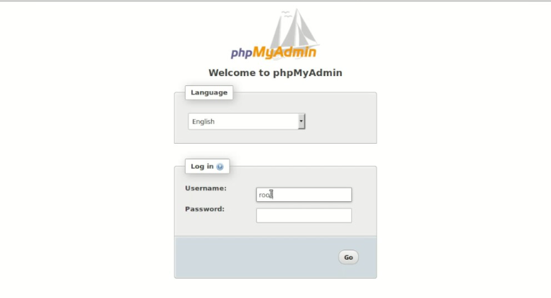
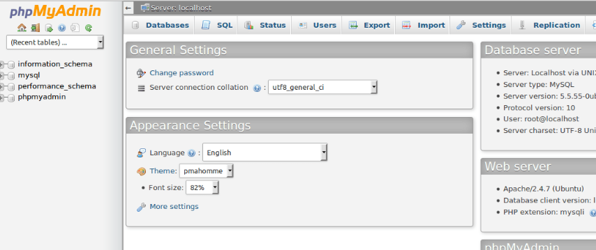

# Modul 300 - Leistungsbeurteilung 2

## Inhaltsverzeichnis
 - [Service](#Service)
 - [Dockerbefehle](#Dockerbefehle)
 - [Technische Angaben](#Technische-Angaben)
 - [Testing](#testing)
 - [Troubleshooting](#Troubleshooting)

## Service

Die LB2 besteht darin, ein Service zur Verfügung zu stellen. Dieser Service sollte mit Docker realisiert werden. Das ganze sollte anschliessend mit Markdown dokumentiert werden. Die Bewertungskriterien findet man [hier](https://bscw.tbz.ch/bscw/bscw.cgi/d29299146/LB2%20Anforderungen.pdf).

Bei meinem Service werden zwei Container erstellt. In dem einem Container befindet sich phpMyAdmin mit Apache2. In dem anderen Container befindet sich eine MySql Datenbank. MySql soll mit phpMyAdmin kommunizieren.

## Dockerbefehle

|Befehl | Effekt|
|:--:|:--:|
|docker build|Aus einem Dockerfile heraus ein Image bauen|
|docker run|Container starten|
|docker start|Einen gestoppten Container starten|
|docker stop|Einen Container stoppen|
|docker kill|Einen Container gewaltsam stoppen|
|docker ps|Alle laufenden Container auflisten|
|docker compose|Multi-container Umgebung starten|

## Technische Angaben
  

Man braucht eine Linux Desktop Umgebung. Dort muss man noch Docker installieren. Hier wäre der entsprechende Befehl:
~~~~
sudo apt-get install docker.io
~~~~
Um Container 1 zu starten geht man in den Ordner webserver rein. Dort befindet sich ein Dockerfile. In diesem Ordner gibt man dann diese Befehle ein:
~~~~
docker build -t webserver .
docker run --rm -d -p 8080:80 webserver
~~~~
So sieht das Dockerfile aus:
~~~~
FROM ubuntu:14.04

MAINTAINER David Milovanovic

RUN apt-get update

RUN apt-get -q -y install apache2 

# Konfiguration Apache

ENV APACHE_RUN_USER www-data

ENV APACHE_RUN_GROUP www-data

ENV APACHE_LOG_DIR /var/log/apache2

RUN mkdir -p /var/lock/apache2 /var/run/apache2

#Für phpMyAdmin prompt-Config, das kommentierte sind die alten Befehle, welche ich umschreiben musste

#RUN debconf-set-selections <<< "phpmyadmin phpmyadmin/dbconfig-install boolean true"

#RUN debconf-set-selections <<< "phpmyadmin phpmyadmin/app-password-confirm password asdf123"

#RUN debconf-set-selections <<< "phpmyadmin phpmyadmin/mysql/admin-pass password asdf123"

#RUN debconf-set-selections <<< "phpmyadmin phpmyadmin/mysql/app-pass password asdf123"

#RUN debconf-set-selections <<< "phpmyadmin phpmyadmin/reconfigure-webserver multiselect apache2"

RUN echo 'phpmyadmin phpmyadmin/dbconfig-install boolean true' | debconf-set-selections

RUN echo 'phpmyadmin phpmyadmin/app-password-confirm password asdf123' | debconf-set-selections

RUN echo 'phpmyadmin phpmyadmin/mysql/admin-pass password asdf123' | debconf-set-selections

RUN echo 'phpmyadmin phpmyadmin/mysql/app-pass password asdf123' | debconf-set-selections

RUN echo 'phpmyadmin phpmyadmin/reconfigure-webserver multiselect apache2' | debconf-set-selections

#Installation phpMyAdmin

RUN sudo apt-get -y install phpmyadmin

EXPOSE 80

VOLUME /var/www/html

CMD /bin/bash -c "source /etc/apache2/envvars && exec /usr/sbin/apache2 -DFOREGROUND"

~~~~
Als nächstes geht man in den Ordner mysql rein. Dort gibt man dann diese Befehle ein:
~~~~
docker build -t mysql .
docker run --rm -d -p 3306:3306 mysql
~~~~
So sieht dieses Dockerfile aus:
~~~~
FROM ubuntu:14.04

MAINTAINER David Milovanovic

#Prompt befehle für mysq-server

RUN echo 'mysql-server mysql-server/root_spassword password asdf123' | debconf-set-selections 

RUN echo 'mysql-server mysql-server/root_password_again password asdf123' | debconf-set-selections 

# Installation

RUN apt-get update

RUN apt-get install -y mysql-server

#Port für alle Hosts öffnen

RUN sed -i -e"s/^bind-address\s*=\s*127.0.0.1/bind-address = 0.0.0.0/" /etc/mysql/my.cnf

EXPOSE 3306

VOLUME /var/lib/mysql

CMD ["mysqld"]
~~~~

## Testing

| Testfall                                                                                               | Resultat                                                                                                                                |
|--------------------------------------------------------------------------------------------------------|-----------------------------------------------------------------------------------------------------------------------------------------|
| Git clone                                                               | Funktioniert einwandfrei                                                        |
| Container starten lassen                                        | Die Container lassen                                      |
| Vom Client auf http://localhost:80/phpmyadmin                                                                                                | Funktioniert. Phpmyadmin Startseite wird angezeigt.                                                       | 
| Mit root und Passwort anmelden                                                                                            | Funktioniert                                                         |

## Troubleshooting
* Sicherstellen, dass man Root-Rechte hat.
* Schreib- und Leserechte sollten richtig verteilt sein.
* Das Mounten von Volumes braucht Shared Drives für Linux-Container.
* Auf die Versionen achten. Manche Versionen sind nicht miteinander kompatibel.

### Ressourcen-Begrenzung
|Suffix | Effekt|
|:--:|:--:|
|-m|RAM begrenzen. (-m 4m ist z.B. 4MB)|
|--kernel-memory|Kernel-Memory begrenzen|
|--cpus=<value>|Stellt ein wie viel CPU-Ressourcen der Container benutzen darf (z.B bei 2 CPUs kann man 1.5 eingeben um nicht alles zu benutzen|

## Reflexion

Ich habe mich schon die letzen Monaten die ganze Zeit gefragt, was eigentlich Docker ist und wie es funktioniert. Ich konnte aus dem Internet nie wirklich verstehen, was der Sinn von Docker ist. Durch die guten Dokumentationen auf GitHub konnte ich verstehen, wie alles genau funktioniert und wie man eine Docker Umgebung selber bauen kann. Das Modul war sehr anspruchsvoll, jedoch sehr lehrreich. 